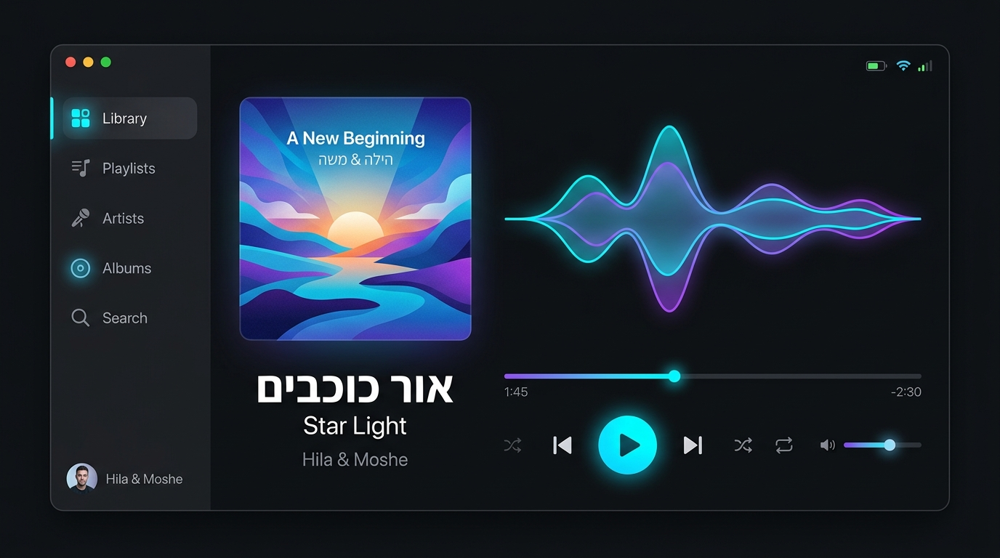
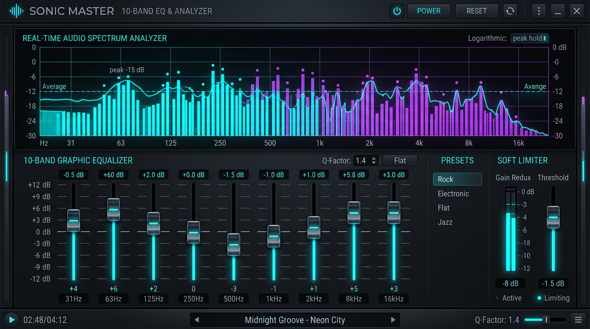
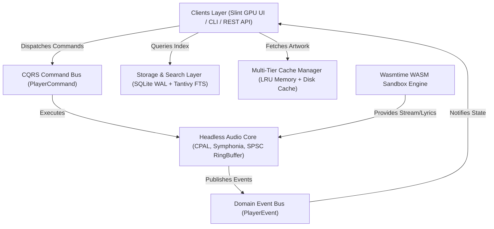

<div align="center">

# 🎵 Aether Sound System (`just-music`)

**Commercial-Grade, Ultra-Fast, Professional Desktop Music Player & Real-Time Audio Engine in 100% Pure Rust**


<br />



*Aether Sound System featuring modern dark obsidian glassmorphism UI, real-time waveform visualization, and full Hebrew & English RTL/LTR support.*

</div>

---

## 🚀 Product Vision & Performance Benchmarks

`Aether Sound System` is engineered to compete directly with leading commercial desktop players (such as **Foobar2000**, **Spotify Desktop**, **MusicBee**, and **AIMP**), combining absolute audio fidelity with sub-30ms startup times, ultra-low RAM footprint, and instant sub-millisecond search over 500,000+ tracks.

### 📊 Competitive Comparison Table

| Metric / Feature | Foobar2000 | Spotify Desktop | MusicBee / AIMP | **Aether Sound System (Ours)** |
| :--- | :--- | :--- | :--- | :--- |
| **Cold Start Time** | ~50ms | 1500ms – 3000ms | ~400ms | **⚡ < 30ms** |
| **Idle Memory Footprint** | ~15MB | 300MB – 600MB | 60MB – 120MB | **💎 25MB – 35MB** |
| **UI Rendering Stack** | Win32 C++ (Legacy) | Electron / CEF (Heavy) | .NET / Win32 | **🦀 Rust GPU Native (Slint / Vello)** |
| **Full-Text Search (500k tracks)** | Basic | Cloud-dependent | Moderate | **🚀 Tantivy FTS5 Instant (< 1ms)** |
| **BiDirectional (RTL) Hebrew** | Poor / Broken | Partial | Limited | **🇮🇱 100% Native BiDi (Cosmic-Text)** |
| **Audio Loop Allocation** | Low | High | Medium | **🔒 Zero-Allocation Lock-Free SPSC** |

---

## ✨ Key Features

### 🎧 Headless Real-Time Audio Engine
* **Pure Rust Zero-Copy Decoder:** Powered by `Symphonia` supporting bit-perfect decoding for **MP3, FLAC, WAV, AAC, OGG Vorbis, Opus, AIFF, ALAC**.
* **Hardware Acceleration:** Native WASAPI low-latency output via `CPAL`.
* **Zero-Allocation Audio Thread:** Single-Producer Single-Consumer (`rtrb`) lock-free ring buffer running at `THREAD_PRIORITY_TIME_CRITICAL` to prevent audio stutter or buffer underruns.

### 🎛️ 10-Band Graphic Equalizer & DSP Pipeline

* **Digital IIR Biquad Filters:** Direct Form II Transposed 10-band graphic equalizer (31Hz to 16kHz) with gain controls (-12dB to +12dB).
* **Logarithmic Volume Control:** Perceptual volume attenuation curve with built-in soft peak limiters to prevent digital clipping.

### 🔍 Tantivy Full-Text Instant Search
* Sub-millisecond instant search over half a million tracks powered by `Tantivy` in Pure Rust.
* Supports prefix matching and fuzzy searches in Hebrew, Latin, and mixed scripts without accent/diacritic bottlenecks.

### 🇮🇱 Native RTL (Hebrew) & LTR (English) BiDi Engine
* Dynamic BiDirectional text shaping (`cosmic-text` and `unicode-bidi`).
* Automatic Mirroring Layout System that adjusts grid containers, track lists, progress bars, and controls dynamically based on active locale.

### 📊 Multi-Tier Cache & Virtualization
* **Virtual List Recycling:** Viewport calculator for smooth 120 FPS scrolling of 500,000+ track libraries.
* **Multi-Tier Cache Manager:** Seamless coordination between LRU In-Memory Cache and persistent disk cache for artwork, thumbnails, and peak waveforms.

### 🧩 Capability-Isolated WebAssembly Plugins
* WebAssembly runtime powered by `Wasmtime` providing a secure capability-isolated sandbox for custom online music providers and lyrics fetchers.

---

## 🏗️ System Architecture & CQRS Pattern



---

## 📂 Workspace Crate Structure

```
aether-player/
├── .cargo/config.toml             # Build & Toolchain Configurations
├── docs/assets/                   # UI Mockups & Graphics Assets
└── crates/
    ├── aether-core/               # Domain Models, CQRS Commands, PlayerEvents & AetherError
    ├── aether-audio/              # Headless Audio Engine (Symphonia, CPAL, RingBuffer, DSP)
    ├── aether-storage/            # SQLite Database (WAL Mode) & Tantivy FTS Instant Search
    ├── aether-library/            # Multi-threaded Folder Scanner & Real-Time File Watcher
    ├── aether-cache/              # Multi-Tier LRU Memory & Persistent Disk Cache Engine
    ├── aether-provider/           # Async Trait Interfaces for Music & Lyrics Providers
    ├── aether-plugin/             # Wasmtime WebAssembly Sandbox Engine
    ├── aether-monitor/            # Internal Diagnostic Metrics (CPU, RAM, Audio Buffer, Latency)
    ├── aether-ui/                 # Design System, BiDi RTL/LTR Engine & Virtual List Calculator
    └── aether-desktop/            # Binary Entrypoint & Application Subsystem Wiring
```

---

## 🛠️ Building & Running

### Prerequisites
- [Rust Toolchain](https://rustup.rs/) (Stable 1.75+)

### Quick Start

```bash
# 1. Clone the repository
git clone https://github.com/Amlaach/just-music.git
cd just-music

# 2. Verify workspace crates
cargo check --workspace

# 3. Execute unit & integration test suites
cargo test -p aether-core -p aether-audio -p aether-ui -p aether-cache -p aether-monitor

# 4. Launch Aether Sound System
cargo run -p aether-desktop
```

---

## 🔒 Security & Privacy

> [!IMPORTANT]
> **Zero Telemetry Policy:** Aether Sound System collects **zero analytics**, sends no background pings to external servers, and stores 100% of library data locally on your computer.

---

## 📄 License

Distributed under the **MIT License** or **Apache-2.0 License**.
